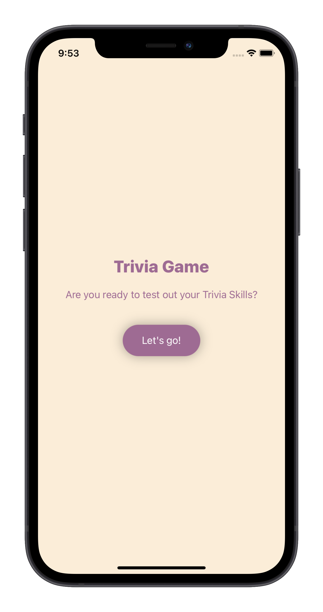
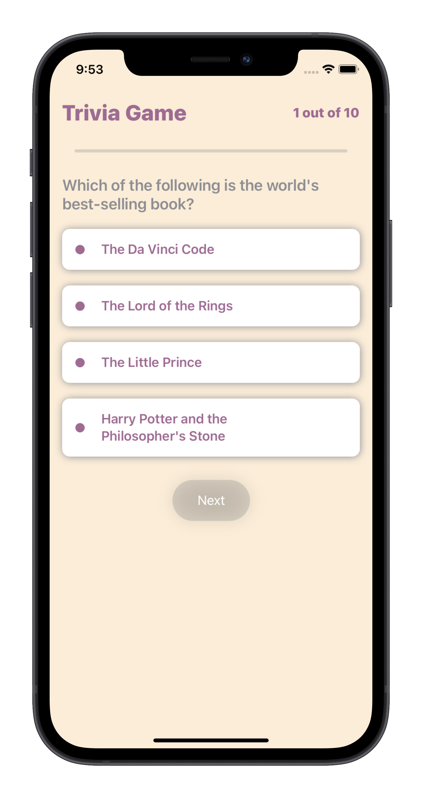
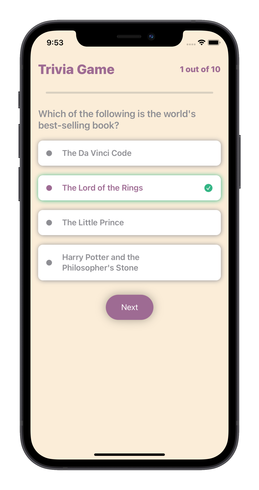
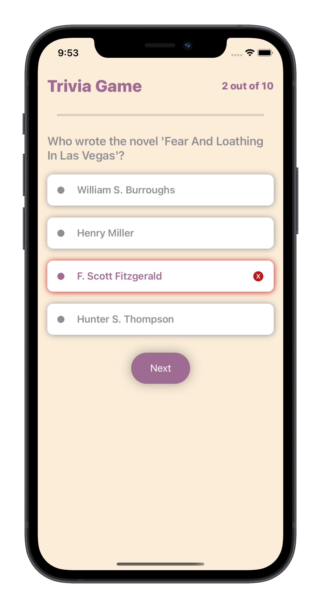
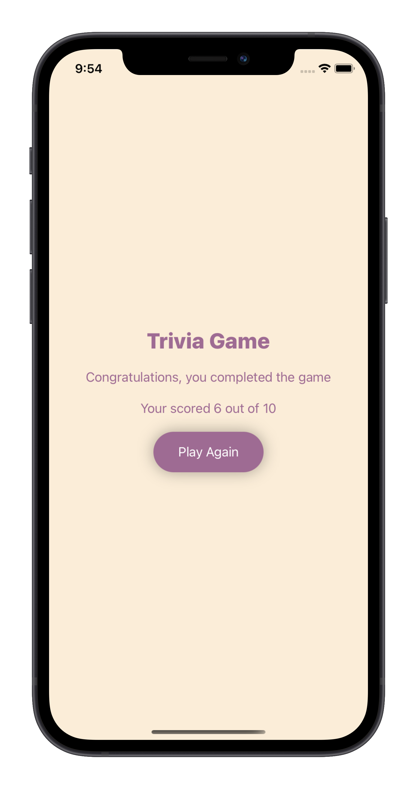

# TriviaGame-SwiftUI

Get Dirty my hand on SwiftUI:
* Used latest API's introduce in Swift 5.5.2
* Also used TRIVIA Free API's.

What I have leared in this Exercise Project.
* How to call the api's in SwiftUI by async await.
* How to used @EnvironmentObject, State and ObservableObject.
* How to update the SwiftUI views.
* How to pass data from viewModel to View.
* How to create custom ProgressBar.
* How to create SwiftUI components.

# Languages / Frameworks Used
* Swift 5.5.2
* SwiftUI 3

# How to run the project ?
* Download the zip file or clone the project, currently there's one master branch.
* Run the project using Xcode( change the bundle identifier, if you want to run it on your device).

# Having trouble ?
* If you are having trouble with this project or if you find any bugs, do open a new issue and describe the problem.
* Alternatively, you can drop me a mail @ rohitku.prajapati@gmail.com.

# Spread the word!
Liked the project? Just give it a star ⭐️ and spread the word!

# Credits
© Rohit Kumar | 2020

